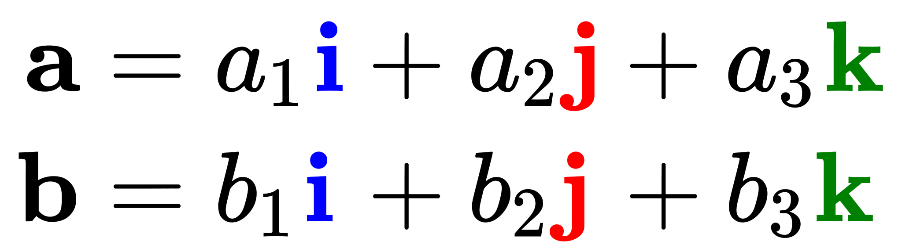
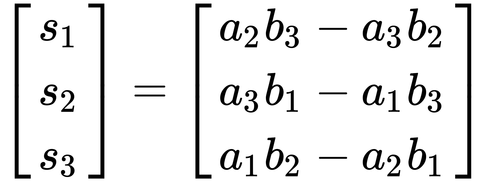
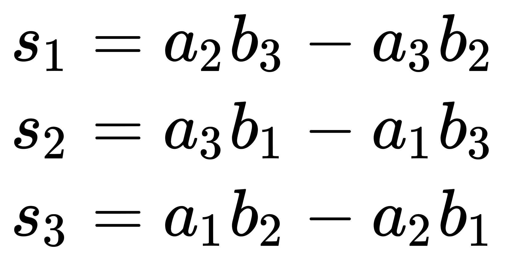
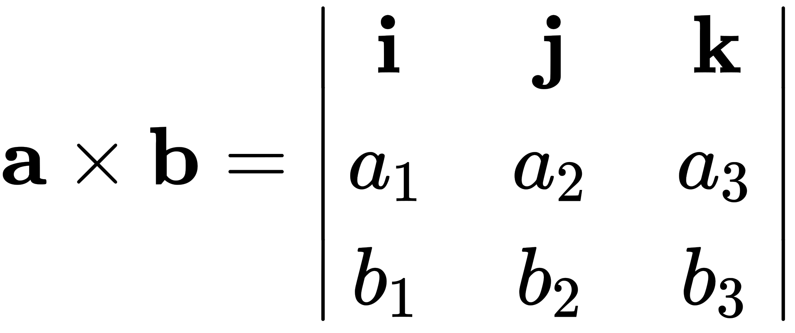
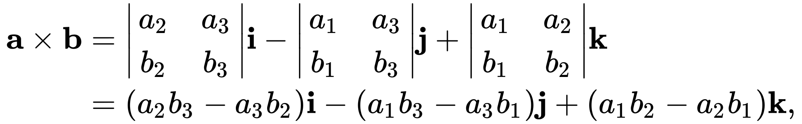
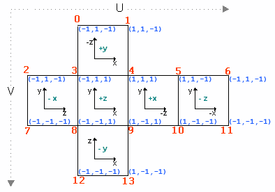

https://en.wikipedia.org/wiki/Cross_product

      plane[p].z_vec[0] = plane[p].core.x_vec[1] * plane[p].core.y_vec[2] -
                          plane[p].core.x_vec[2] * plane[p].core.y_vec[1];
      plane[p].z_vec[1] = plane[p].core.x_vec[2] * plane[p].core.y_vec[0] -
                          plane[p].core.x_vec[0] * plane[p].core.y_vec[2];
      plane[p].z_vec[2] = plane[p].core.x_vec[0] * plane[p].core.y_vec[1] -
                          plane[p].core.x_vec[1] * plane[p].core.y_vec[0];

      [ z0 ]   [ x1*y2 - x2*y1]
      [ z1 ] = [ x2*y0 - x0*y2]
      [ z2 ]   [ x0*y1 - x1*y0]

La norme d'un vecteur (x,y,z), c'est sqrt(x²+y²+z²).

Il faut que cette norme soit égale à 1. Si ce n'est pas le cas, il faut normaliser le vecteur, tout simplement en le divisant par sa norme.

For a cube centered at the origin, with edges parallel to the axes and with an edge length of 2, the Cartesian coordinates 
of the vertices are (±1, ±1, ±1) while the interior consists of all points (x0, x1, x2) with −1 < xi < 1 for all i.

#### 2D vector normalization : 

    length = sqrt(v.x * v.x + v.y * v.y);
    
    // normalize vector
    v.x /= length;
    v.y /= length;
    
    // increase vector size
    v.x *= 10
    v.y *= 10
    

## Les bonnes questions : 

- quels sont les "normales" des faces d'un cube
- [patron cube à imprimer sans colle](https://www.google.com/search?q=patron%20cube%20%C3%A0%20imprimer%20sans%20colle&tbm=isch&hl=fr&sa=X&ved=0CB4QtI8BKAFqFwoTCMC80Zjg94ADFQAAAAAdAAAAABAl&biw=1671&bih=1018)

## Layout

## A voir : 

projection 3D : 

- **http://www.paul-reed.co.uk/programming.html**
- https://www.google.com/imgres?imgurl=https%3A%2F%2Fwww.researchgate.net%2Fpublication%2F324314917%2Ffigure%2Ffig2%2FAS%3A613281144262656%401523229027039%2FEquirectangular-perspective-and-flattening-i-i-maps-to-i-i-on-the-sphere-by.png&tbnid=Kk0Rtf8SY86mJM&vet=12ahUKEwiUhq2R4feAAxXHgv0HHbUvDaMQxiAoBHoECAAQJw..i&imgrefurl=https%3A%2F%2Fwww.researchgate.net%2Ffigure%2FEquirectangular-perspective-and-flattening-i-i-maps-to-i-i-on-the-sphere-by_fig2_324314917&docid=X5IPi_JrR3bkBM&w=701&h=906&itg=1&q=quels%20sont%20les%20%22normales%22%20des%20faces%20d%27un%20cube&ved=2ahUKEwiUhq2R4feAAxXHgv0HHbUvDaMQxiAoBHoECAAQJw
  - https://www.researchgate.net/figure/An-omnidirectional-image-obtained-by-equirectangular-projection-a-Spherical_fig2_314105432
